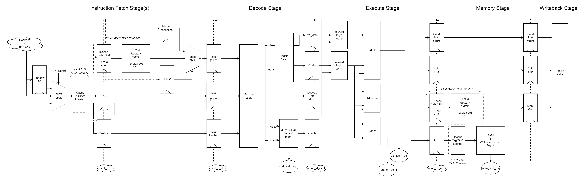
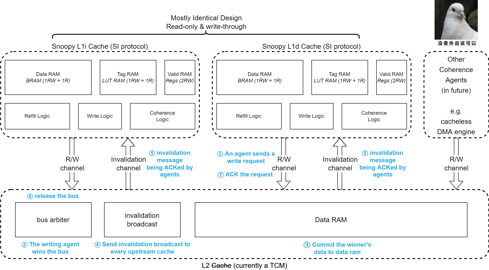

# (Discontinued) rv5stage

My very first attempt on pipelined processor.

Also, this is my course project for XJTU CompOrg class.

Features:

1. 6-staged vendor-agnostic, FPGA-optimized pipeline. It runs at ~70MHz on XC7A100T-1
2. Seperate direct-mapped I/D Cache
3. Simulate-everything with verilator (thanks to [ZipCPU](https://zipcpu.com/blog/2017/05/19/fpga-hell.html)) to avoid FPGA hell
4. Coherence support based on a homemade bus and SI protocol
5. UART controller @ 115200Hz

# Diagrams

